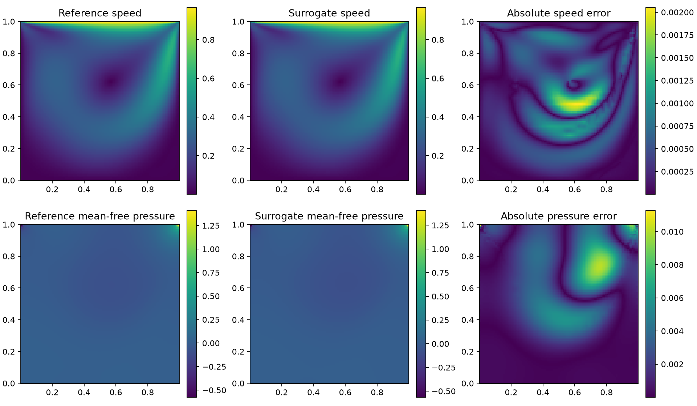
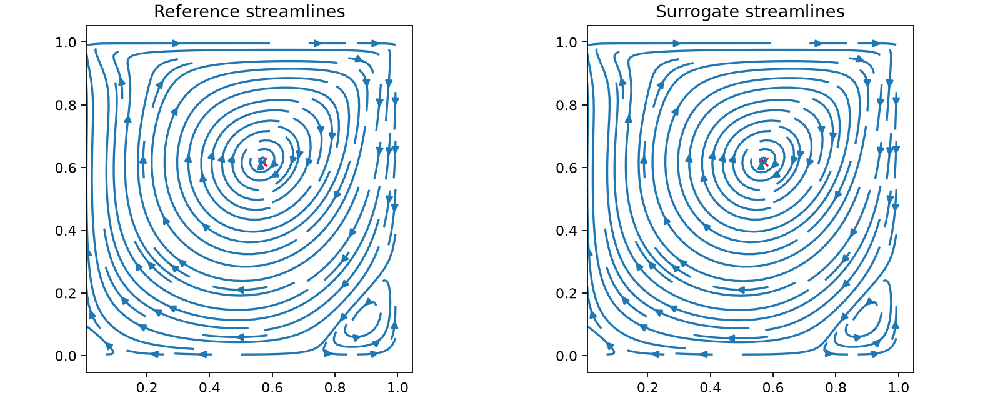
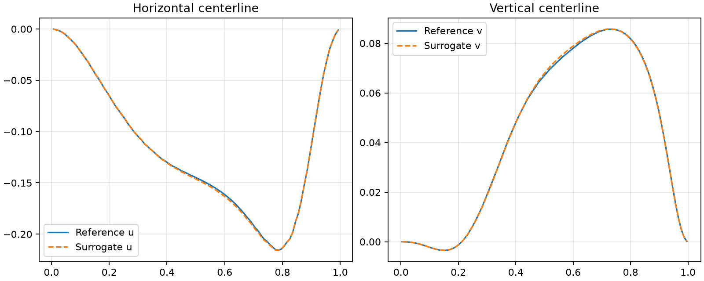

# 二维方腔代理模型训练闭环项目周报（第 02 期）

> 汇报日期：2026-07-24  
> 建议时长：15–20 分钟  
> 汇报对象：项目负责人、管理层与技术复核人员  
> 本期主线：真实 Fluent 多工况数据、POD-RBF Full 封存验收与 Re=310.5 域内推理演示

## Executive Summary

本期完成了仓库的第四个代理模型训练闭环：在固定二维顶盖驱动方腔中，以 Reynolds 数 `Re` 为输入，用 Ansys Fluent 2024 R1 生成真实稳态流场，再由 POD-RBF 学习 `Re → (u,v,p')` 的映射。流程已经贯通确定性采样、真实 Fluent 求解、逐批独立重载、协议验证、Smoke 选模、Full 冻结、一次性 sealed-test、`accepted` 状态和受保护域内推理。

Full 共使用 120 个互不重复的 Reynolds 数工况，按 80/20/20 划分为训练、验证和封存测试。运行 `cavity2d-full-20260723T185548Z-8cb01c1e` 已进入 `accepted`：20 个封存测试工况上的速度场相对 L2 中位/P95/最差误差为 `0.111% / 0.230% / 0.420%`，去均值压力场为 `1.702% / 7.903% / 8.977%`，主涡中心 P95 位置误差为 `0`。

为验证模型不是在复述已有样本，本期又选择训练域内但从未出现在训练、验证或 sealed-test 中的 `Re=310.5`，分别执行一次全新 Fluent 求解和 accepted 模型推理。速度场误差为 `0.159169%`，去均值压力场误差为 `4.045223%`，合并中心线速度误差为 `0.329163%`；Fluent 与代理模型识别出的主涡中心完全一致。

性能方面，本机 Fluent 单工况求解阶段为 `39.0594 s`；代理模型冷启动端到端 CLI 中位耗时为 `1.8052 s`，约加速 `21.64×`。模型和依赖已预加载后的纯推理平均耗时为 `0.1819 ms`，墙钟比约 `214688×`。两种口径分别代表“当前可直接演示的完整命令”和“服务化后可能接近的核心推理成本”，不能混为同一个生产性能结论。

因此，本期结论是：当前仓库已经能在冻结的单位方腔、稳态层流、固定网格和 `Re∈[10,400]` 合同内，对未见 Reynolds 数快速预测完整流场。它不是任意 Navier–Stokes 求解器，也不覆盖不同几何、顶盖速度、瞬态、湍流或训练域外工况。

## 首版问题合同：能求解什么

首版能力有意收窄为一个可验证的算子学习问题：

```text
输入：Re ∈ [10,400]
输出：固定 3550 单元中心上的 u(x,y)、v(x,y)、p'(x,y)
```

其中：

- 几何为二维单位正方形，顶盖速度固定为 `(u,v)=(1,0)`；
- 其余三面为无滑移壁面；
- 流体不可压、层流、稳态；
- 通过改变黏度实现不同 `Re`；
- `p'` 为逐样本去均值压力，以消除压力参考常数；
- 几何、网格、边界条件、求解设置和输出字段均冻结。

这一定义使当前模型能够回答“同一方腔在不同域内 Re 下的稳态流场是什么”，但不能回答“任意方腔或任意 CFD 问题是什么”。

## 闭环架构：Fluent 真值到可信推理

高保真求解与代理训练分属两个仓库，并通过显式证据协议连接：


- `fluent-automation` 负责实际启动 Fluent、固定物理设置、求解、字段导出、case/data 保存和全新会话重载。
- `surrogate-loop` 负责样本身份与划分、证据验证、POD-RBF 训练、评价、状态机和受保护推理。
- 任一批次若没有通过残差、设置、字段有限性、退出或进程审计，流水线都会停止，不会用伪数据或跳过失败继续训练。

代理模型把速度 `(u,v)` 和压力 `p'` 分为两个分支执行 POD，用训练数据提取低维模态，再由 RBF 在 Reynolds 数轴上插值模态系数。Full 最终选择 `multiquadric` 核、`1e-10` smoothing、4 个速度模态和 2 个压力模态。

## 从单点协议到 Full accepted

| 阶段 | 规模 | 结果 | 证明范围 |
|---|---:|---|---|
| vertical | Re=100 | 真实 Fluent 求解、3550 单元字段和全新会话重载通过 | 单点协议与数据形状 |
| calibration | Re=10/100/400 | 三个边界与代表工况全部通过 | 参数域内数值稳定性与成本 |
| Smoke | 16/4/4，共 24 工况 | `development_complete` | 多 Re 数据、选模、评价、报告和推理开发链 |
| Full | 80/20/20，共 120 工况 | `accepted` | 冻结合同下一次性确认性验收 |
| 独立演示 | Re=310.5 | Fluent 与 accepted 模型完成同场对比 | 域内未见 Re 的直观插值效果 |

Smoke 的 24/24 个求解样本、3 个批次代表样本重载全部通过。速度相对 L2 中位/P95/最差为 `0.134% / 0.735% / 0.836%`，压力为 `0.967% / 3.121% / 3.406%`。Smoke 可用于发现问题和选择模型，因此只形成开发证据，不替代 Full。

Full 使用与 Smoke 无精确重叠的 120 个新 Reynolds 数。15 个求解批次的 120/120 个样本全部通过，随后 15/15 个代表样本在全新 Fluent 会话中独立重载成功；冻结模型和门槛后才一次性消费 20 个 sealed-test 工况。

实际阶段耗时为：Smoke 约 25 分钟；Full 求解约 85.6 分钟、独立重载约 10.4 分钟、代理训练与验收约 8.5 分钟。当前离线成本主要来自 Fluent 样本生成与审计，而不是 POD-RBF 训练。

## Full 封存验收结果

| 指标 | Full 实测 | 结论 |
|---|---:|---|
| 速度场相对 L2 中位 | 0.111% | 通过 |
| 速度场相对 L2 P95 | 0.230% | 通过 |
| 速度场相对 L2 最差 | 0.420% | 通过 |
| 去均值压力场相对 L2 中位 | 1.702% | 通过 |
| 去均值压力场相对 L2 P95 | 7.903% | 通过 |
| 去均值压力场相对 L2 最差 | 8.977% | 通过 |
| 合并中心线速度相对 L2 | 0.209% | 通过 |
| 主涡中心 P95 误差 | 0 | 通过 |
| 预测字段有限性 | 全部有限 | 通过 |

最差速度和压力工况均为 `full-116`，对应 `Re=390.59384112`。即使在该高 Re 域内尾部工况，速度场最差误差仍为 `0.420%`；压力误差相对更高，是当前模型进一步优化时应优先关注的指标。

Full 报告记录的 Fluent 单样本平均墙钟为 `32.1958 s`，代理模型单样本平均墙钟为 `0.000243425 s`，比值约 `132262×`。产物中的历史字段名为 `cpu_speedup`，但实际测量是当前机器上的墙钟时间比；本报告不把它表述为累计 CPU time 或跨机器固定性能。

## Re=310.5 未见工况演示

`Re=310.5` 没有出现在 Full 的 80 个训练样本、20 个验证样本或 20 个封存测试样本中。最近的 sealed-test Reynolds 数为 `310.0844994621011`，距离为 `0.4155005379`。因此，这次演示是冻结训练域内的未见点插值，而不是训练样本回放，也不是域外外推。

Fluent 在 1291 次迭代后收敛，continuity、x-velocity 和 y-velocity 的最终残差分别为 `9.899e-7 / 4.658e-9 / 3.6746e-9`。字段在 3550 个固定单元中心导出，case/data 在全新 Fluent 会话中独立重载通过，未留下归属进程。

| 对比项 | Re=310.5 结果 |
|---|---:|
| 速度场相对 L2 | 0.159169% |
| 去均值压力场相对 L2 | 4.045223% |
| 合并中心线速度相对 L2 | 0.329163% |
| 水平中心线速度相对 L2 | 0.376514% |
| 竖直中心线速度相对 L2 | 0.280268% |
| Fluent 主涡中心 | `(0.5690140845, 0.6190426118)` |
| 代理模型主涡中心 | `(0.5690140845, 0.6190426118)` |
| 当前观测网格上的主涡位置误差 | 0 |

## 全场数值对比

下图上排依次为 Fluent 速度大小、代理模型速度大小和绝对误差；下排为 Fluent 去均值压力、代理模型去均值压力和绝对误差。两种解使用完全相同的 3550 个单元中心坐标。



速度和压力主结构在视觉上保持一致。误差图使用独立色标放大小差异，因此不能直接用误差图颜色与原场颜色比较量级；定量结论应以上表的相对 L2 为准。

## 流线与主涡对比



代理模型复现了顶盖驱动形成的主环流、右下角次级涡以及主涡中心位置。图中红色标记为从统一插值观测网格识别的主涡中心，Fluent 与代理结果重合。

## 中心线速度对比



水平中心线的 `u` 和竖直中心线的 `v` 曲线几乎重合。中心线是方腔流常用的低维剖面检查，但本次验收同时使用完整网格全场误差，避免只凭两条曲线判断模型质量。

## 求解速度与演示口径

| 路径 | 统计方式 | 本机墙钟 | 相对 Fluent |
|---|---|---:|---:|
| Fluent 单工况 | 本次 Re=310.5 求解阶段 | 39.0594 s | 1× |
| 代理冷启动 CLI | 5 次中位数 | 1.8052 s | 21.64× |
| 模型预加载纯推理 | 1000 次平均 | 0.000181936 s | 214688× |

三个时间的工作范围不同：

- Fluent 时间包含独立初始化、迭代、字段提取、验收计算、transcript 处理和 case/data 写出，不包含 Fluent 进程启动、网格读取和设置。
- 冷启动 CLI 包含新 Python 进程、accepted 产物清单验证、模型加载、推理和压缩 NPZ 写出，最接近当前正式演示命令。
- 预加载时间只包含已载入模型的 `predict`，适合说明模型服务或交互式应用的核心推理潜力，不代表完整生产请求耗时。

上一次演示耗时长的主要原因不是 Fluent 单次求解或代理推理本身，而是首次演示同时承担了环境预检、模型及网格身份检查、回归测试、重载审计、绘图环境验证和冷启动准备。这些工程检查用于建立证据，不应在每次汇报现场重复。正式演示应使用已合并代码、已验收模型、预生成绘图和预加载进程，把现场主路径压缩为一次 Fluent 求解、一次代理推理和结果展示。

## 工程审计与失败恢复

本次闭环保留了失败证据，而不是覆盖历史：

- 早期真实求解尝试暴露了 Fluent 会话、字段导出和重载协议问题，均通过追加式尝试修复。
- Smoke 重载时发现黏度在 HDF5 往返后存在 1 ULP 浮点差异；修复只对黏度使用 `1e-12` 相对容差，其他设置继续精确比较。
- Re=310.5 演示的第一次启动因隔离 worktree 没有本地 `.env` 而在启动 Fluent 前失败；随后完成环境注入并以新尝试成功，失败证据保留。
- Full 封存测试前后均执行回归检查；最终 `surrogate-loop` 为 290 passed / 5 skipped，`fluent-automation` 为 423 passed，两个仓库 Ruff 均通过。
- 所有成功求解阶段均完成归属进程审计，未发现残留 Fluent 进程。

这说明当前成果不仅有数值精度，还具备“请求—求解—字段—重载—训练—冻结—验收—推理”的可追溯工程证据。

## 当前结论与能力边界

### 已经具备

- 用真实 Fluent 批量生成 `Re∈[10,400]` 的固定方腔稳态流场。
- 对每批求解执行残差、设置、字段、case/data、全新会话重载和进程审计。
- 在训练、验证和 sealed-test 分离条件下训练并冻结 POD-RBF。
- 通过 Full `accepted` 运行对域内未见 Re 输出完整 `(u,v,p')` 场。
- 生成全场误差、压力、流线、主涡、中心线和物理诊断图。
- 拒绝 `Re=401`、`NaN` 等域外或非法输入，且不生成输出文件。

### 尚不具备

- 不支持改变方腔长宽比、网格或几何。
- 不支持改变顶盖速度、壁面类型或其他边界条件。
- 不支持瞬态、周期流、湍流或更高 Reynolds 数。
- 不支持训练域外推理安全保证。
- 不等价于任意 Navier–Stokes 方程或通用 CFD 求解器。
- 训练标签仍来自数值求解器，不替代实验验证或独立第三方基准。
- 统一插值观测网格上的散度和动量项只是代理场诊断，不是 Fluent 原生有限体积离散残差。

## 下一阶段建议

1. 将方腔功能分支、周报和文档体系一起合入 `main`，固定正式汇报入口。
2. 增加“一键演示”命令，复用已验收模型、固定图片模板和预检缓存，将现场准备与数值求解分开。
3. 以压力尾部误差为主要优化对象，判断是否需要增加压力模态、调整采样密度或采用更强的系数回归器。
4. 引入经典中心线参考数据或独立求解器交叉验证，加强科学正确性证据。
5. 若要扩展几何、边界或更高 Re，重新定义输入空间、数据规模、模型结构和验收合同，不把首版模型直接外推。

## 证据链附录

| 证据 | 本地入口 |
|---|---|
| Smoke → Full 执行记录 | `runs/cavity2d-smoke-full-20260724-execution.md` |
| Full accepted 运行 | `runs/cavity2d-full-20260723T185548Z-8cb01c1e/` |
| Full 封存指标 | `runs/cavity2d-full-20260723T185548Z-8cb01c1e/test_metrics.json` |
| Full 图形报告 | `runs/cavity2d-full-20260723T185548Z-8cb01c1e/report/` |
| Re=310.5 演示摘要 | `runs/cavity2d-demo-re310p5-20260724/report/demo_summary.json` |
| Re=310.5 计时证据 | `runs/cavity2d-demo-re310p5-20260724/report/timing_evidence.json` |
| 方腔设计合同 | [二维方腔 Navier–Stokes 代理模型闭环设计](../superpowers/specs/2026-07-23-二维方腔NS代理模型闭环设计.md) |
| 方腔操作入口 | [二维顶盖驱动方腔 Fluent + POD-RBF 算例](../../examples/cavity_2d_fluent/README.md) |

`runs/` 被 Git 忽略，因此运行目录使用反引号路径；关键数字和三张演示图片已经写入本周报并纳入 Git。Full 的 Fluent 完成清单 SHA-256 为 `E4BFDD77EE030B8BE069B771C1BCA29B3392AF89B6B16CFF99464B728C969F3D`，代理 artifact manifest SHA-256 为 `B5273CE139DA55BB22918EE436DE2C923F8A1129E4A1CDB5E87462A911B96C5A`。

## Caveats and Assumptions

- `accepted` 表示冻结的方腔 v1 合同和域内 sealed-test 下验收通过，不表示生产认证、实验验证或域外泛化保证。
- Full 指标来自 20 个一次性 sealed-test 工况；它们刻画当前采样合同，不是连续 Reynolds 数域上的数学误差上界。
- Re=310.5 是域内未见点演示，但与最近 sealed-test Re 的距离只有 `0.4155`；它证明当前局部插值效果，不单独证明整个连续区间的最坏情况。
- 所有性能数字只适用于本机、本次软件版本和对应计时范围；跨机器、并发、批量或服务化场景需要重新基准。
- 图形通过固定网格插值生成，适合直观比较；精度结论仍以同一坐标上的数值指标为准。
- 历史设计、计划和第 01 期周报按其记录时点理解，当前方腔能力以本周报、稳定状态页和 accepted 运行产物为准。
